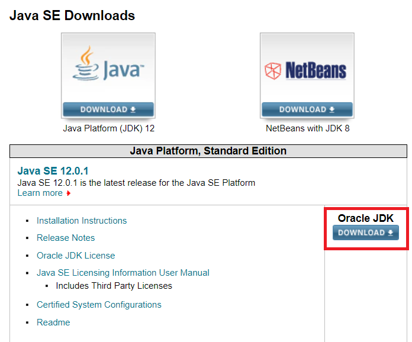
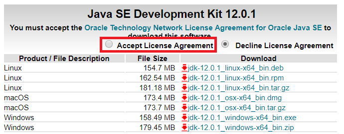

# 자바 개발환경 구축

## JDK 설치

* [JDK Download](https://www.oracle.com/technetwork/java/javase/downloads/index.html)

위 사이트에 들어가면 아래 사진과 같이 뜸.

위 사진에서 **빨간 부분**을 누른다.

그러면 위 부분으로 넘어갈텐데 **빨간 부분에 체크**를 하고 아래 자신의 사양에 해당하는 파일을 다운받고 프로그램을 설치한다.

설치할 때 경로를 지정하는데 **이 설치 경로는 환경변수를 설정할 때 필요함.**

## 환경변수 설정

환경변수를 설정 안해줘도 자바가 돌아가는데 영향을 끼치진 않다.

환경변수를 설정하는 것은 보다 **파일의 접근을 쉽고 편하기 위해 설정하는 것**.

### Windows 10 기준으로 설명

1. [검색]에서 시스템(제어판)을 검색하여 선택합니다.
2. 고급 시스템 설정 링크를 누릅니다.
3. 환경 변수를 누릅니다.
4. 시스템 변수 아래 새로 만들기를 누릅니다.
5. 변수 이름은 JAVA_HOME 으로 하고 변수 값은 아까 JDK를 설치한 경로를 쓰고 저장합니다.
6. 또 새로만들기를 눌러 이름은 CLASSPATH, 값은 %JAVA_HOME%\lib 로 저장합니다.
7. 시스템 변수에서 Path 를 더블클릭 하여 새로 만들기를 누릅니다.
8. %JAVA_HOME%\bin 를 추가하고 확인을 누릅니다.
9. 시스템 속성 창이 뜰 때 까지 확인을 누른다음 적용을 누릅니다.

위 단계를 다 하시고 cmd를 키시고 java -version을 치고나서 자바 버전이 제대로 뜬다면 환경변수를 제대로 설정한 것.

## 자바 통합 개발 환경(IDE) 설치

**통합 개발 환경** :  코딩, 디버그, 컴파일, 배포 등 프로그램 개발에 관련된 모든 작업을 하나의 프로그램 안에서 처리하는 환경을 제공하는 소프트웨어이다.

### IDE 목록

* [Eclipse](https://www.eclipse.org/downloads/)
* [IntelliJ](https://www.jetbrains.com/idea/download/)
* [Visual Studio Code](https://code.visualstudio.com/Download)
* 기타 등등